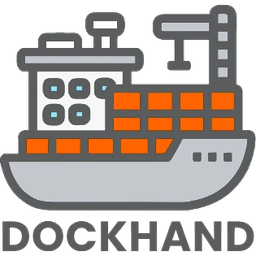

[](https://github.com/hacs/integration)
[](https://github.com/raetha/ha-dockhand/releases)
[](https://github.com/raetha/ha-dockhand/actions/workflows/ci.yml)
[](https://analytics.home-assistant.io/custom_integrations.json)



# Dockhand for Home Assistant

Monitor and control your Docker environments through **[Dockhand](https://dockhand.pro)** — a modern Docker management UI. This integration exposes environments, containers, stacks, networks, images, volumes, and schedules as Home Assistant devices and entities, using the same API as the Dockhand web UI.

No cloud services are used. Supports **API token authentication** and works with Dockhand instances where authentication is disabled.

Want dashboard cards, not just entities? See **[ha-dockhand-cards](https://github.com/raetha/ha-dockhand-cards)** — Lovelace cards modeled on Dockhand's own UI (environment, environment overview, vulnerability, stack, and container cards), built on top of the entities this integration provides.

---

## Installation

### HACS (Recommended)

This integration is not yet in the default HACS catalog. You can add it as a custom repository:

1. Open HACS in Home Assistant
2. Go to **Integrations**
3. Click the **⋮** menu → **Custom repositories**
4. Enter the repository URL: `https://github.com/raetha/ha-dockhand`
5. Set category to **Integration** and click **Add**
6. Find **Dockhand** in the integration list and install it
7. Restart Home Assistant

[](https://my.home-assistant.io/redirect/hacs_repository/?owner=raetha&repository=ha-dockhand&category=integration)

### Manual

1. Copy the `custom_components/dockhand/` folder into `<HA config>/custom_components/dockhand/`
2. Restart Home Assistant

---

## Setup

1. Go to **Settings → Devices & Services → Add Integration**
2. Search for **Dockhand**
3. Enter the **API URL** (e.g. `http://dockhand.local:3000`) and SSL preference
4. The integration probes the server. If authentication is enabled you'll be prompted for an **API token** — generate one in Dockhand under **Profile → API tokens**
5. Set poll intervals and enable any optional features (schedules, images, volumes, networks, container updates). All of these can be changed later via **Configure**

To change the URL, SSL setting, or API token after setup, use **Reconfigure** (three-dot menu on the integration card)

---

## Configuration parameters

### Setup fields (entered once at install time)

| Field | Description | Default |
|---|---|---|
| **API URL** | Full URL to your Dockhand server, e.g. `http://dockhand.local:3000` | — |
| **Verify SSL certificate** | Validate the server's SSL/TLS certificate. Uncheck only if your Dockhand instance uses a self-signed certificate | on |
| **API Token** | A Dockhand API token starting with `dh_`. Only prompted if the server requires authentication. Generate one under **Profile → API tokens** | — |

### Options (adjustable via Configure)

The following can be changed at any time via the **Configure** button on the integration card, without removing the integration. Changes take effect on the next coordinator refresh.

| Field | Description | Default |
|---|---|---|
| **Fast poll interval** | How often (seconds) to refresh container states, stacks, and environment stats. Minimum: 10 | 60 |
| **Slow poll interval** | How often (seconds) to refresh images, volumes, networks, and schedules. Minimum: 30 | 600 |
| **Enable schedules** | Create entities for Dockhand scheduled tasks | off |
| **Enable images** | Create entities for Docker images on each host | off |
| **Enable volumes** | Create entities for Docker volumes on each host | off |
| **Enable networks** | Create entities for Docker networks on each host | off |
| **Enable precise update versions** | Update entities already exist automatically for every container in an environment where update-check is enabled in Dockhand itself, showing an image tag and an `update-pending` status from Dockhand's own cached results — no extra API cost. This adds real registry queries on the interval below, upgrading those same entities to show precise version numbers (image digests) instead | off |
| **Update check interval** | How often (seconds) the real registry queries above run. Each check queries the registry for every container — keep this infrequent (minimum: 300). Only relevant when **Enable precise update versions** is on | 86400 |
| **Enable runtime controls** | Create `number`/`select` entities to change a stack-less container's memory limit, CPU limit, process limit, and restart policy live, without recreating it. Not available for Compose-managed containers. Costs one extra API call per stack-less container per slow poll | off |
| **Enable container stats** | Create the per-container CPU, memory, network, and block I/O sensors — not created at all until this is on, same as Images/Volumes/Networks below. Also gates the underlying stats API call itself, not just entity creation. Off since it's a lot of entities most people don't need | off |

### Reconfigure (change URL, SSL, or API token)

Use **Reconfigure** (three-dot menu → Reconfigure) to change the **API URL**, **Verify SSL** setting, or **API Token**. The token field is pre-populated and masked — clear it to disable authentication (you will be re-prompted if the server still requires it), or enter a new value to rotate credentials. The integration re-probes the server on save.

---

## Authentication

### API token (recommended)
When Dockhand authentication is enabled, the integration authenticates using a **Bearer token** (`dh_...`). Tokens do not expire by default (unless you set an expiry when generating), which means no periodic re-authentication prompts.

To generate a token:
1. Open the Dockhand UI and click your avatar in the sidebar
2. Scroll to **API tokens**
3. Click **Generate token**, give it a name, and optionally set an expiry
4. Copy the token immediately — it is shown only once
5. Paste it into the HA integration setup or re-authentication prompt

> **Requires Dockhand ≥ 1.0.26.** Token authentication was introduced in 1.0.25 but had a bug with enterprise licences that was fixed in 1.0.26.

### No-auth installs
If Dockhand authentication is fully disabled, no token is needed. The integration detects this automatically during setup and skips the token prompt. If you later enable authentication in Dockhand, HA will surface a re-authentication prompt the next time a poll fails.

### Re-authentication
If a token is revoked or expires, the integration will surface a re-authentication notification in HA. Go to **Settings → Devices & Services → Dockhand → Re-authenticate**, generate a new token in Dockhand, and paste it in.

---

## Device model

The integration uses a **grouped device hierarchy** that keeps the device list manageable regardless of how many containers and stacks you have.

```
myenv                                       ← Environment device
├── myenv – Containers                      ← Group device (freestanding containers only)
│   └── myenv – Containers – mycontainer   ← Container device
│       ├── switch  (primary — no suffix)
│       ├── sensor.State
│       ├── sensor.Health              ← only if container has a healthcheck
│       ├── button.Restart
│       ├── update                     ← if container updates enabled
│       └── (diagnostic, disabled by default)
│           ├── sensor.CPU usage
│           ├── sensor.Memory usage
│           ├── sensor.Memory usage %
│           ├── sensor.Memory limit
│           ├── sensor.Network in / Network out
│           └── sensor.Disk read / Disk write
├── myenv – Stacks                          ← Group device
│   └── myenv – Stacks – mystack      ← Stack device
│       ├── switch  (primary — no suffix)
│       ├── sensor.Status
│       ├── sensor.Containers
│       └── button.Restart
├── myenv – Networks  (if enabled)          ← Group device
│   └── sensor.bridge                  ← one entity per network (no sub-devices)
├── myenv – Volumes  (if enabled)           ← Group device
│   └── sensor.myvolume                ← one entity per volume (no sub-devices)
└── myenv – Images  (if enabled)            ← Group device
    └── sensor.nginx                   ← one entity per image (no sub-devices)

sensor.CPU usage, sensor.Memory usage, sensor.Containers  ← on env device
binary_sensor.Online
button.Check for updates               ← if container updates enabled

Dockhand – Schedules  (if enabled)         ← Global hub device (not env-specific)
└── Dockhand – Schedules – nightly-backup ← per-schedule device
    ├── sensor.Next run
    └── sensor.Last status
```

**Entity ID convention:** `<platform>.<env>_<type>_<name>_<attribute>` — for example `sensor.myenv_containers_mycontainer_state` or `switch.myenv_stacks_mystack`. The type segment (`containers`, `stacks`, `images`, etc.) makes entity_ids unambiguous even when a container and stack share the same name.

Each device in the list shows its **Type** (`model` field), so it's easy to distinguish containers from stacks, and group devices from individual ones. Every device also has a direct **open in Dockhand** link that takes you straight to the corresponding page.

Container and stack switches are **primary entities** — the entity name equals the device name with no suffix, following HA convention for the principal on/off control of a device.

### Portainer users
If you're also running the Portainer integration, note that this integration uses the same structural patterns — one environment device, child devices for containers and stacks, a control switch and `Restart` button per container and stack.

---

## Entities reference

### Environment (always on, 60 s)
| Entity | Type | Notes |
|---|---|---|
| Online | binary_sensor | Connectivity device class. Attributes: `name` (environment display name), `connection_host`/`connection_port` (the environment's configured Docker connection endpoint, from `/api/environments`), `labels` (the tags you've assigned to the environment in Dockhand) |
| Connection type | sensor | `socket` / `direct` / `hawser-standard` / `hawser-edge` — matches Dockhand's own connection-type indicator, including its icon per type |
| CPU usage | sensor | %, with `cpu_count` (logical CPU count, from `GET /api/host`) and `top_containers` (top 5 by CPU — name/CPU%/memory%; only populated when **Enable container stats** is on) attributes |
| Memory usage | sensor | %, with used/total bytes attributes |
| Containers running | sensor | with total/stopped/unhealthy attributes |
| Images | sensor | count of Docker images on the environment |
| Image pruning | binary_sensor | whether automatic image pruning is enabled for this environment. Disabled by default |
| Update all | button | Updates every container in the environment with a pending update in one batch (pull, scan if configured, recreate) — matches Dockhand's own "Update all" button exactly. Named "Update all containers" (a static name; Dockhand's own button shows a live "(N)" count, but a changing friendly name on a persistent entity reads as confusing churn in HA's own history, so ours doesn't). "Pending update" considers both the cheap cached check and, if enabled, the precise digest check — a container flagged by either counts. System containers are excluded from the count and from the update, same as Dockhand's own button. **Only exists while there's at least one pending update** — like Dockhand's own button, it's not just disabled with nothing to do, it isn't there at all until something needs updating |

The following are sourced from `GET /api/host` (already polled every slow cycle for the Hawser version sensor — no extra API call) but are **disabled by default**, since they're niche/diagnostic. Enable the ones you want in **Settings → Entities**.

| Entity | Type | Notes |
|---|---|---|
| Hawser agent version | sensor | Live-fetched from the agent for standard-mode Hawser connections. `agent_name`/`agent_id`/`last_seen` attributes shown only for edge-mode connections (the only mode Dockhand populates them for), sourced from `/api/environments` |
| Host platform | sensor | OS platform, e.g. `linux`, with an `architecture` attribute, e.g. `x64` |
| Docker version | sensor | Docker Engine server version |
| Host last boot | sensor | Timestamp, computed from host uptime |

Also disabled by default, but at no extra cost — the data's already part of the same `/api/dashboard/stats` call already polled every 60s:

| Entity | Type | Notes |
|---|---|---|
| Disk usage | sensor | Total bytes across images, volumes, containers, and build cache, with each broken out as an attribute — matches Dockhand's own disk-usage breakdown |

Also disabled by default, each sourced from its own gated API call — only fetched at all when the matching Dockhand setting is on for that environment, so an environment that doesn't use the feature never pays for the extra request:

| Entity | Type | Notes |
|---|---|---|
| Activity events | sensor | Total event count, with a `today` attribute and a `recent_events` list attribute (last 10, each with container name/action/timestamp). Only polled when **Activity collection** is on for the environment in Dockhand |
| Vulnerabilities | sensor | Total finding count from Dockhand's own vulnerability scanner, with `critical`/`high`/`medium`/`low` and `images_scanned`/`total_images` attributes. Only polled when **Vulnerability scanning** is on for the environment in Dockhand |

### Container (always on, 60 s)
| Entity | Type | Notes |
|---|---|---|
| State | sensor | running / exited / paused / etc. |
| Health | sensor | healthy / unhealthy / starting. Only created for containers with a Docker healthcheck configured — enabled by default |
| Container | switch | turn on = start, turn off = stop. **Not created for system containers** (Dockhand itself, or a Hawser agent) — see note below |
| Restart | button | restarts running container (use Container to start stopped). **Not created for system containers** — see note below |
| Update | update | Created automatically for every container in any environment with update-check enabled in Dockhand — no config option needed. Shows the image tag as `installed_version`, and flips `latest_version` to `update-pending` as soon as Dockhand's own scheduled update-check finds one, with no registry query of its own. Enable **Enable precise update versions** in Configure to also show real image-digest version numbers via periodic registry queries. Install triggers a scanned pull-and-recreate via Dockhand's `batch-update-stream` API (works at either tier — it only needs the container ID), honoring the environment's configured vulnerability blocking policy, and reports live install progress. Disabled for system containers and containers with `dockhand.update=false` label |
| Memory limit, CPU limit, Process limit | number | Live in-place resource limits (0 = unlimited, except Process limit where -1 = unlimited, matching Docker's own convention). Stack-less (non-Compose) containers only. **Optional — enable via Configure**, disabled by default in the entity registry. **Not created for system containers** — see note below |
| Restart policy | select | Live restart policy (`no`/`always`/`unless-stopped`/`on-failure`). Stack-less containers only. **Optional — enable via Configure**, disabled by default in the entity registry. **Not created for system containers** — see note below |
| Auto update | switch | Toggles Dockhand's own scheduled auto-update check for this container (distinct from the Update entity above, which is manual/HA-triggered). Persisted by container name, survives recreation. Not gated behind Configure — always available, disabled by default in the entity registry. **Not created for system containers** — see note below |

The following **diagnostic sensors** are also created for every container but are **disabled by default**. Enable the ones you want individually in **Settings → Entities**. They show as unavailable when the container is stopped or exited.

| Entity | Type | Unit | Notes |
|---|---|---|---|
| CPU usage | sensor | % | Percentage of total host CPU capacity |
| Memory usage | sensor | bytes (displayed in MiB) | Effective memory in use; page cache excluded. Includes `memory_cache_bytes` state attribute |
| Memory usage % | sensor | % | Memory used relative to configured limit (or host RAM if no limit is set) |
| Memory limit | sensor | bytes (displayed in MiB) | Configured container memory limit, or host RAM when unconstrained |
| Network in | sensor | bytes (displayed in MiB) | Cumulative bytes received; resets to 0 on container restart |
| Network out | sensor | bytes (displayed in MiB) | Cumulative bytes transmitted; resets to 0 on container restart |
| Disk read | sensor | bytes (displayed in MiB) | Cumulative block I/O reads; resets to 0 on container restart |
| Disk write | sensor | bytes (displayed in MiB) | Cumulative block I/O writes; resets to 0 on container restart |

### Stack (always on, 60 s)
| Entity | Type | Notes |
|---|---|---|
| Status | sensor | running / partial / stopped. The stack device's `model` (Internal Stack / Git Stack / Untracked Stack) shows why a stack does or doesn't have the git-stack entities below. "Untracked" matches Dockhand's own terminology for a stack it discovered but never created/adopted/git-tracked through its own UI |
| Stack | switch | turn on = start, turn off = stop. **Not created for a stack containing a system container** — see note below |
| Restart | button | restarts running stack (use Running to start stopped). **Not created for a stack containing a system container** — see note below |
| Redeploy | button | pulls the latest image for each service and redeploys — matches Dockhand's own Redeploy popover exactly, including its own literal button title, with its default checkboxes (Pull images checked, Build images and Force recreate unchecked), so it behaves the same as clicking Redeploy in Dockhand's own UI without touching any options. Only recreates containers whose config actually changed (e.g. a new image digest) — doesn't force-recreate everything. **Internal stacks only** — git stacks have their own Deploy/Sync from Git button (below) with different mechanics; not created for Untracked stacks (no compose file location for Dockhand to redeploy from) or for a stack containing a system container |
| Updates available | binary_sensor | on when any container in the stack has a pending image update, with an `update_count` attribute. Requires Dockhand 1.0.37+ — automatically not created on older versions, since this data isn't in the API response at all until then |

> **System containers.** Dockhand classifies its own management container and any Hawser remote agent as "system containers" — Dockhand's own UI hides start/stop/restart for these (and for any stack containing one), since taking them down can break Dockhand's ability to manage the host at all. Dockhand's API itself doesn't enforce this — only its UI does — so this integration enforces it independently: the Container/Stack switch, Restart button, container Auto update switch, and runtime controls (memory/CPU/process limits, restart policy) simply aren't created for a system container or a stack that contains one. Read-only entities (State, Health, resource sensors) are unaffected.

The following are created automatically whenever a stack is detected as **git-tracked** — no config option needed (it's one bulk API call per environment, not per-stack).

| Entity | Type | Notes |
|---|---|---|
| Sync status | sensor | `pending`/`syncing`/`synced`/`error`. Attributes include last commit, sync error, auto-deploy, and webhook-enabled |
| Last sync | sensor | Timestamp of the last git sync |
| Sync error | binary_sensor | On when the last sync/deploy attempt failed |
| Deploy / Sync from Git | button | Same underlying action either way (sync from git, then redeploy) — the name and icon change based on the stack's current status to match Dockhand's own labeling exactly: **"Deploy"** (rocket icon) while the stack is down (not yet deployed, or created but not started), **"Sync from Git"** (refresh icon) once it's up. Unlike the internal-stack Redeploy button above, this does **not** guarantee a fresh image pull or a forced recreate: whether containers actually get recreated depends on whether the git sync found real changes, and whether images get re-pulled depends on this git stack's own "repull images" setting in Dockhand (not something this integration can override per-press) — a Dockhand API limitation, not a choice made here. There's no separate check-only Sync button — Dockhand's own `deployGitStack()` always runs the identical sync step first regardless of whether a deploy follows, confirmed from source, so a standalone check-only action would add no real capability. *Dockhand's own terminology/iconography here may change in a future version; if you notice this drift from what Dockhand itself calls it, that's worth flagging.* |
| Auto deploy | switch | Toggles the stack's own scheduled sync+redeploy job. Disabled by default in the entity registry |

### Network (optional, 600 s)

One entity per network, living under the **{env} – Networks** group device.

| Entity | Type | Notes |
|---|---|---|
| *network-name* | sensor | Named for the network (e.g. `bridge`); state is connected container count; attributes include driver, scope, subnet, and connected container names/IPs |

### Volume (optional, 600 s)

One entity per volume, living under the **{env} – Volumes** group device.

| Entity | Type | Notes |
|---|---|---|
| *volume-name* | sensor | Named for the volume; state is connected container count (0 = unused/dangling); attributes include in_use bool, container list, driver, scope, mountpoint, labels, and created timestamp |

### Schedule (optional, 600 s)

Two entities per schedule, parented to a per-schedule device under the **Schedules** hub. The per-schedule device structure is preserved to future-proof for Dockhand API additions (run-now, enable/disable).

| Entity | Type | Notes |
|---|---|---|
| Next run | sensor | TIMESTAMP device class; suitable for time-based automation triggers. Attributes include cron expression, enabled state, environment name, and schedule type |
| Last status | sensor | DIAGNOSTIC; string value (`success`, `failed`, etc.) — use a `state` trigger for clean failure-alert automations. Attributes include triggered_by, triggered_at, duration_ms, error_message |

> Schedules are **read-only**. Dockhand does not expose a run-now API endpoint, so no action button is provided. The per-schedule device is kept for when this changes.

---

## Container and Stack controls

| What you want | How to do it |
|---|---|
| Start a stopped container | Turn **Container** switch **on** |
| Stop a running container | Turn **Container** switch **off** |
| Start a stopped stack | Turn **Stack** switch **on** |
| Stop a running stack | Turn **Stack** switch **off** |
| Restart a container or stack | Press **Restart** button |

The Restart button only works when the container or stack is already running — Docker cannot restart a stopped one. If a container has stopped unexpectedly, turn the **Container** switch on first, then use **Restart** if needed.

---

## Example automation

```yaml
automation:
  - alias: "Alert when container goes down"
    triggers:
      - trigger: state
        entity_id: sensor.traefik_state
        to: exited
    actions:
      - action: notify.mobile_app_your_phone
        data:
          title: "Container down"
          message: "traefik has stopped"
```

---

## Data Updates

Dockhand uses three polling coordinators with independent intervals:

**Fast coordinator** (default 60 s, configurable) fetches:
- Environment dashboard stats for all environments in a single API call (CPU, memory, container/stack/image/volume/network counts, whether update-check is enabled)
- Full container list with state, image, and label details
- Full stack list with status and container counts
- Container resource stats for all running containers per environment in a single bulk API call (`GET /api/containers/stats?env=N`) — one call per environment regardless of container count. Stopped, exited, or created containers are absent from this response; their stats sensors show unavailable until running again
- A cheap, no-registry-query check of Dockhand's own cached pending-update flags, for any environment with update-check enabled — this is what powers the `update-pending` status on update entities

**Slow coordinator** (default 600 s, configurable) fetches:
- Per-environment detailed data for optional features: Images, Networks, Volumes, runtime controls
- Git stack sync status, host info (platform/arch/Docker version/uptime), and container auto-update settings — always fetched, no config option needed, since these are single cheap bulk calls per environment
- Global schedule list
- A handful of fields with no other source (image-prune enabled, Hawser agent identity, configured connection host/port)

**Update coordinator** (default 86400 s / 24 h, configurable) — only active when **Enable precise update versions** is turned on. Update entities themselves always exist for any environment with update-check enabled in Dockhand, and this coordinator is purely additive for them — it only upgrades their version display from an image tag to a precise digest, never gates whether they exist. It's also one of two signals (alongside the cheap cached check) that can make the env-level **Update all** button appear:
- Per-environment image update availability via `POST /api/containers/check-updates`, which performs real registry queries against each container's image source. Kept infrequent to avoid unnecessary load on the Docker host. Use the **Check for image updates** button on any environment device (visible when this option is on) to trigger an immediate check on demand.

Entities update automatically when their coordinator refreshes. If a fetch fails, entities remain at their last known value and are marked unavailable after the coordinator's built-in retry threshold. All three coordinators handle token errors transparently — a 401 response surfaces a re-authentication notification in HA rather than silently retrying.

## Troubleshooting

**Cannot connect**
Check the API URL is reachable from the HA host. If authentication is enabled, confirm your API token starts with `dh_` and was copied in full.

**Entity IDs have a `_2` or `_3` suffix after a container or image update**
Image sensors specifically now avoid this in the common case: when a container update causes two images to briefly claim the same tag (the newly-pulled one, and the old one not yet marked untagged), the integration waits for that to settle — usually resolved within a poll cycle or two — rather than creating a colliding entity. If you still see a suffix (a device or entity type not covered by that handling, or an unusually long-lived ambiguity), it means HA created a new entity while an old one with the same natural ID still technically existed at that moment. Once the old object is gone and the integration has reloaded or polled, go to **Settings → Devices & Services → ⋮ → Recreate entity IDs** on the Dockhand integration card to reclaim the clean ID — HA will rename any suffixed entity whose "natural" ID is now free. Any automations or dashboard cards referencing the suffixed ID will need to be updated after the rename.

**No entities appear after setup**
Check HA logs for errors containing `dockhand`. Ensure the user account has permission to view all environments.

**Schedules show but no "run" button**
Intentional — the Dockhand API has no run-now endpoint for schedules. The per-schedule device structure is preserved for when this is added.

---

## Requirements

- Home Assistant 2026.3 or later (requires Python 3.14)
- Dockhand ≥ 1.0.26 (for API token authentication; no-auth installs work on any version)
- Dockhand reachable from the HA host

---

## Notes

- All data is fetched locally — no external cloud services
- Only the API token is stored in the HA config entry; no username or password is ever stored
- The Restart button only works on *running* containers/stacks
- Disable **Verify SSL certificate** only if using a self-signed certificate on the Dockhand server
- Containers with the `dockhand.hidden=true` label are filtered from Dockhand's API responses and will not appear in HA
- **To exclude a container or stack from HA entirely**, the cleanest approach is to add the `dockhand.hidden=true` Docker label — it is filtered at the Dockhand API level so those containers never appear in HA at all. If you want the container visible in Dockhand but not in HA, disable the device in HA instead: go to **Settings → Devices & Services → Dockhand**, find the device, and use the three-dot menu → **Disable**. Disabling a device disables all of its entities at once and survives integration reloads. To act on many devices at once, use the **Devices** tab filter to narrow the list (e.g. filter by integration = Dockhand), then select multiple rows and use the bulk action menu.

---

## Translations

The integration ships with machine-generated translations for German, Spanish, French, Italian, Norwegian, Dutch, Polish, Portuguese, Swedish, and Chinese (Simplified), alongside the primary English strings. Native speaker corrections and new language additions are welcome — see [CONTRIBUTING.md](CONTRIBUTING.md) for details.

---

## Attribution

This integration was developed by **[@raetha](https://github.com/raetha)** with design assistance and code generation by **[Claude](https://claude.ai)** (Anthropic).

---

## License

MIT

## Removal

To remove the Dockhand integration from Home Assistant:

1. Go to **Settings → Devices & services**.
2. Find the **Dockhand** integration card and click on it.
3. Click the three-dot menu (⋮) and select **Delete**.

All devices, entities, and configuration data created by this integration will be removed
automatically. No edits to `configuration.yaml` are required. Any automations or dashboard
cards referencing Dockhand entities should be updated or removed manually.

### Uninstalling via HACS

After deleting the integration from Settings, go to **HACS → Integrations**, find
**Dockhand**, and click **Remove**. Restart Home Assistant when prompted.
